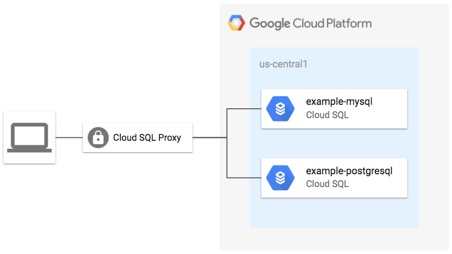

# Cloud SQL Database Example

This example shows how create Cloud SQL databases for for MySQL and PostgreSQL using the Terraform module.

**Figure 1.** *diagram of Google Cloud resources*



## Run Terraform

```
terraform init
terraform plan
terraform apply
```

## Test connection to database

1. Install the Cloud SQL Proxy:

```bash
wget https://dl.google.com/cloudsql/cloud_sql_proxy.$(uname | tr '[:upper:]' '[:lower:]').amd64 -O cloud_sql_proxy
chmod +x cloud_sql_proxy
```

2. Run the Cloud SQL proxy in the background:

```bash
MYSQL_CONN_NAME=$(terraform output mysql_conn)
PSQL_CONN_NAME=$(terraform output psql_conn)

./cloud_sql_proxy -instances=${MYSQL_CONN_NAME}=tcp:3306,${PSQL_CONN_NAME}=tcp:5432 &
```

3. Get the generated user passwords:

```
echo MYSQL_PASSWORD=$(terraform output mysql_user_pass)
echo PSQL_PASSWORD=$(terraform output psql_user_pass)
```

4. Test the MySQL connection:

```
mysql -udefault -p --host 127.0.0.1 default
```

> When prompted, enter the value of MYSQL_PASSWORD

5. Test the PostgreSQL connection:

```
psql -h 127.0.0.1 --user default
```

> When prompted, enter the value of PSQL_PASSWORD

## Cleanup

1. Stop the Cloud SQL Proxy:

```bash
killall cloud_sql_proxy
```

2. Remove all resources created by terraform:

```bash
terraform destroy
```